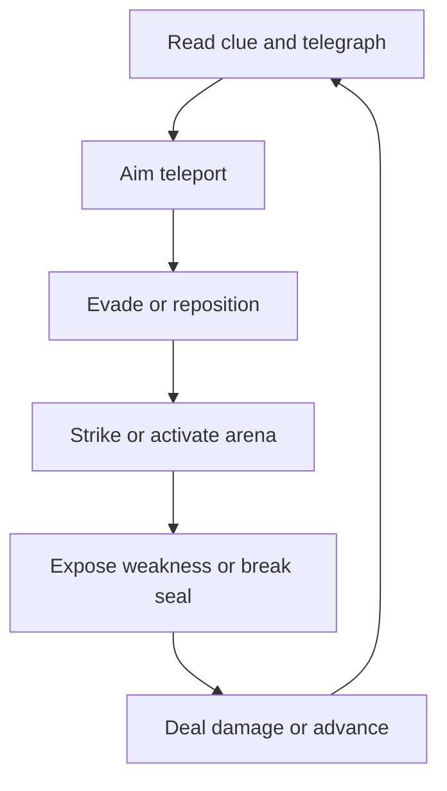
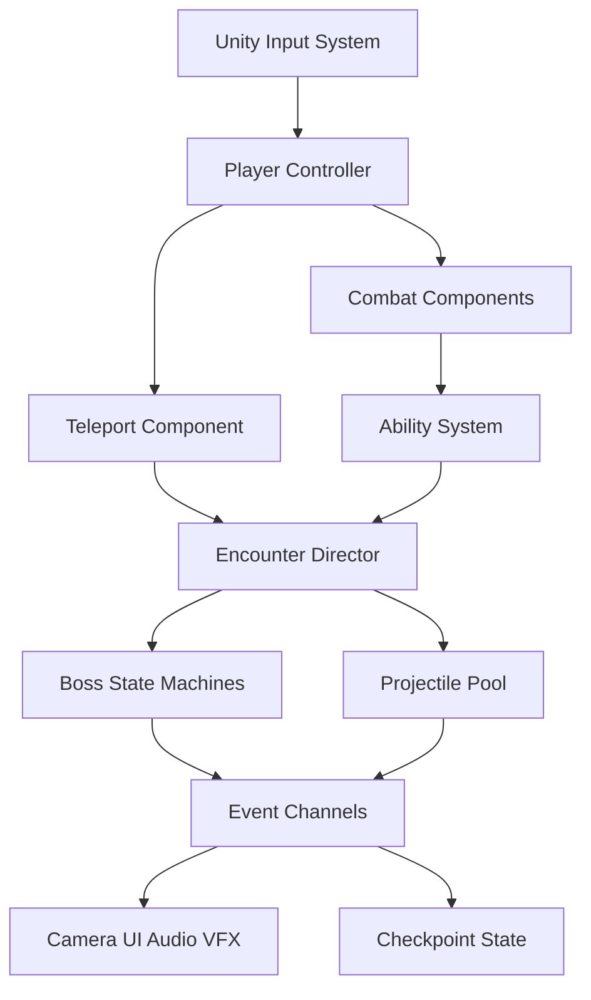

# Phase 1 Proposal — Forgotten Shadow: The King’s Gauntlet

## Project snapshot

| Item | Decision |
|---|---|
| Genre | Single-player 2.5D action boss-rush with roguelite influence |
| Engine | Unity 6 LTS, Universal Render Pipeline |
| Platform | Windows PC |
| Target play time | 15–20 minutes |
| Primary mechanic | Short-range directional teleportation |
| Content | Three compact guardian rooms and one final survival-puzzle room |
| Production strategy | Side-view gameplay using modular 3D assets, shared rigs, and a constrained camera |

## 1. Scene summary

### Premise

An ancient kingdom built magical weapons from soul-storing jewels. Its king sought immortality, but the sorcerer who taught him the ritual transformed him into the faceless Shadow King. Every human soul consumed by the weapons now strengthens him. He is preparing a permanent portal from the Shadow World to the human world.

The protagonist has intentionally become a shadow because only a shadow can enter the King's realm. They begin with a normal sword, three teleport charges, and the ability to drain magic from defeated creatures. The proposed vertical slice is the final approach to the King: three guardians protect his chamber, and each carries a power required to reverse his immortality ritual.

### Scene goal

The player must defeat three guardians, absorb their powers, enter the throne room, survive the Shadow King's magical shots, break the three seals on an imprisoned sorcerer's cage, and kill the sorcerer. The King cannot be killed through ordinary damage; killing the sorcerer reverses the original ritual and removes the King's immortality.

### Start boundary

The scene starts when the player crosses the palace threshold and the entrance seals behind them. A mural establishes four facts without a cutscene: three guardians provide power to the King, a caged sorcerer is connected to him, the King feeds on souls, and a faceless warrior can pass through the Shadow World.

The player begins with:

- Basic movement and jump.
- A three-hit sword combo.
- Three short-range teleport charges.
- A drain interaction used on defeated guardians.
- Full health and no guardian abilities.

No earlier level, inventory, or character-building screen is required for the slice.

### Player journey

#### Room 1 — The Ash Knight

The Ash Knight is protected by burning armour. A stained-glass image shows it kneeling beneath rain. The player avoids two telegraphed attacks, activates a water vessel in the arena, and teleports through the released stream to extinguish the armour. Sword attacks can then damage the exposed core. Draining the defeated Knight grants **Fire Dash**, which damages fragile targets crossed during a teleport.

#### Room 2 — The Drowned Warden

The Warden floods the lower floor and creates a false body. A damaged book describes a charged jewel that once contained it. The player activates two lightning conductors, teleports to a dry platform, and electrifies the water to reveal and stun the real Warden. Draining it grants **Tidal Guard**, a one-hit shield that absorbs an eligible magical projectile.

#### Room 3 — The Hollow Oracle

The Oracle creates three copies. A mosaic shows that fire creates light and water creates reflection. Fire Dash lights the room's braziers; Tidal Guard transfers stored energy to a reflective pool. Only the real Oracle has a reflection. The player identifies it and teleports through the copies to strike. Draining the Oracle grants **Shadow Sight**, which reveals hidden magical connections.

Each guardian is intentionally compact: one weakness, two main attacks, one pressure pattern, and no second phase. This preserves the requested three-boss journey while keeping the semester scope realistic.

#### Final room — The King’s Chamber

The player initially receives the objective **Defeat the Shadow King**. Sword attacks appear to work, but the King regenerates immediately. Shadow Sight reveals three connections between him and the sorcerer's cage, changing the objective to **Reverse the ritual**.

The King remains invulnerable and fires four readable projectile patterns:

- Tracking orbs that reward a late directional teleport.
- A line beam with a clear charge and safe side.
- A portal barrage that fires in a visible sequence.
- A circular soul wave released when a seal breaks.

The player uses water energy to extinguish the burning seal, Fire Dash to break the flooded seal, and Shadow Sight to reveal the final seal. Tidal Guard absorbs one projectile during the final approach. The player enters the fallen cage and kills the sorcerer. The ritual reverses, the permanent portal closes, the King becomes mortal, and the protagonist disappears with the shadow magic sustaining them.

### End boundary

The playable scene ends when the final strike is confirmed. A short in-engine sequence shows the ritual links reversing, the King collapsing, and the protagonist fading. Control is disabled, a completion panel appears, and the player may restart or return to the title screen. There is no playable epilogue in this phase.

### Core gameplay loop

At the input level, the player reads danger, chooses a teleport destination, arrives in an advantageous position, and attacks. At the encounter level, the player observes a clue, manipulates the arena, exposes a weakness, and drains the defeated guardian. At the scene level, three acquired powers become the keys required to solve the final room.

Teleport has three charges. A confirmed sword hit restores part of a charge, and defeating a guardian restores all charges. Teleportation provides a brief invulnerability interval during transit, not after arrival. The destination marker reports valid, obstructed, and out-of-range positions.

### Success states

The player succeeds by:

1. Defeating all three guardians through their intended weaknesses.
2. Acquiring Fire Dash, Tidal Guard, and Shadow Sight.
3. Recognizing that the Shadow King cannot be damaged permanently.
4. Breaking all three cage seals while avoiding the King's shots.
5. Reaching and killing the sorcerer.

### Failure and recovery states

Health reaching zero or falling into a lethal arena hazard causes failure. On standard difficulty, the player restarts at the entrance of the current room. Guardian completion and acquired powers remain saved after each room. The final encounter therefore never requires replaying all three guardians.

The scene must not become unwinnable. Required powers use cooldowns rather than consumable charges, objectives cannot advance until dependencies are valid, and the final room resets every seal and projectile when reloaded. Death-to-retry time should remain below eight seconds.

### Intended player experience

The desired emotional sequence is **mastery → intimidation → discovery → pressure → sacrifice → release**. The guardian rooms make the player increasingly confident with teleportation and elemental interactions. The final room then removes the familiar damage objective and becomes a survival puzzle. The player should feel skilled when teleporting through dense but predictable shots and clever when realizing that the prisoner, not the King, is the real objective.

The ending connects mechanic and story: the faceless protagonist sacrifices their remaining existence to defeat a king who pursued eternal remembrance.

## 2. Benchmark reference

### Target scene video

[Dead Cells — The Hand of the King boss fight](https://www.youtube.com/watch?v=7TxC5Bfiy5Q)

The benchmark is used for encounter clarity and pacing, not for direct reproduction. The target project is 2.5D with 3D assets and a teleport-centred objective, while *Dead Cells* uses pixel art and a broader equipment system.

### Benchmark deconstruction

| Area | Observed benchmark principle | Replicate | Simplify or change |
|---|---|---|---|
| Controls | A small action set supports fast reactions | Immediate movement, attack, and defensive response | Replace rolling and broad weapon variety with one sword and teleport |
| Arena | A bounded room keeps attention on boss patterns | Clear limits, platforms, hazard zones | Use a locked 2.5D plane and one modular 3D room kit |
| AI | Attacks move through anticipation, execution, and recovery | State-driven selection and punishable recovery | Two attacks plus one pressure pattern per guardian |
| Physics/collision | Contact, hazards, and movement produce predictable outcomes | Layer matrix, explicit hitboxes, consistent knockback | No complex rigid-body simulation or destructible physics |
| Camera | Stable framing preserves readability | Keep player, threat, and destination visible | Cinemachine side-view rail; no free camera |
| Visuals | Strong silhouettes and colour-coded danger separate gameplay layers | Consistent hostile and elemental colours | Low-poly 3D materials and lighting instead of unique sprite animation sets |
| Audio | Anticipation and impact cues support visual telegraphs | Unique cue per attack family and confirmed hit | Unity Audio Mixer rather than external middleware |
| UI | Health and encounter state remain visible without obscuring action | Minimal HUD, objective update, ability cooldowns | No inventory, equipment screen, or build UI |
| Progression | Escalation combines previously learned responses | Later room combines powers learned earlier | Fixed powers, no randomized item pool in the slice |
| Retry | Failure teaches patterns and supports another attempt | Fast room restart | Room checkpoints instead of repeating a full run |

### Interaction complexity target

| Player input | Purpose |
|---|---|
| Move | Horizontal positioning on the gameplay plane |
| Jump/drop | Platform and hazard navigation |
| Sword attack | Damage, charge recovery, seal strike |
| Aim + teleport | Traversal, defence, and attack positioning |
| Ability | Fire Dash or Tidal Guard according to context |
| Shadow Sight | Reveal hidden ritual links and the Oracle |
| Interact | Read book or inspect visual clue |

The main technical risk is aiming teleportation while reading projectiles. The greybox must validate this before final art. If free aiming is unreliable, the project will use destination snapping, stronger aim assistance, and optional brief time slowdown.

## 3. Technical plan and competency coverage

### Architecture

### Core gameplay systems engineering

The player controller handles planar movement, jumping, facing, action locks, and animation parameters. Separate components own sword combat, health, teleportation, draining, and abilities. An encounter director controls gates, room states, objectives, checkpoints, success, failure, and reset flow. Guardian abilities are ScriptableObjects so values and feedback references can be tuned without rewriting code.

### Physics and collision systems

The player uses a CharacterController or kinematic Rigidbody constrained to the gameplay plane. Teleport aiming performs a ray cast followed by a capsule overlap at the destination. If the volume is blocked, outside the arena, or on an invalid layer, the destination is rejected. Sword and projectile collisions use explicit hitbox/hurtbox components and a defined Unity layer matrix. Damage is applied once per attack activation through a `DamageData` payload, preventing duplicate hits.

### AI behavior design

Each guardian uses a finite state machine: `Intro`, `SelectAttack`, `Anticipation`, `Execute`, `Recovery`, `Stagger`, and `Death`. Attack ScriptableObjects contain ranges, timing, cooldown, animation, and telegraph data. The Shadow King uses a simpler encounter state machine that sequences projectile patterns according to broken-seal count. The AI does not use navigation meshes because actors remain on the 2.5D plane.

### Real-time graphics pipeline

Unity 6 LTS uses URP with one global Volume profile. The scene uses baked lighting for static architecture, a small number of mixed or real-time lights for magic, GPU-instanced material variants, and restrained transparent effects. Hostile attacks use a magenta-black palette; fire, water, lightning, and ritual links receive distinct colours. Frame Debugger and Rendering Debugger checks will verify overdraw, lighting count, batching, and render order.

### Technical art and polish

Cinemachine provides a side-view rail, framing dead zones, transitions, and impulse-based camera shake. Bosses share rigs and base animation layers where possible. Animation events open hit windows and trigger footsteps or effects. Shader Graph and Particle System assets are parameterized by element, allowing one effect graph to produce several visual variants. Post-processing is limited to colour adjustment, bloom, vignette, and subtle fog; depth-of-field is disabled during combat.

### Audio systems design

Unity Audio Mixer groups music, ambience, player actions, enemies, UI, and voice. Each attack family has a unique anticipation cue and impact cue. Teleport uses a short departure vacuum and directional arrival sound. Guardian musical layers accumulate and combine in the throne room, then drop to near-silence before the final strike. Spatial audio is used for projectiles and arena sources; critical UI confirmations remain non-spatial.

### UI/UX feedback

The HUD contains health, three teleport charges, current guardian ability and cooldown, and the active objective. It does not include inventory or loot. Teleport destinations change colour and shape by validity, boss weakness exposure receives visual and audio confirmation, and an invalid attack against the regenerating King produces explicit feedback before Shadow Sight becomes available. Settings include remapping, aim assist, screen-shake intensity, flash reduction, and independent volume controls.

### Performance optimization and debugging

Projectiles use `UnityEngine.Pool.ObjectPool<T>`. Repeated environment meshes share materials and use static batching or GPU instancing where appropriate. The team profiles the maximum throne-room barrage with Unity Profiler, Frame Debugger, and Memory Profiler. Performance evidence will record frame time, garbage collection allocations, batches, and active projectile count before and after optimization. Debug overlays expose player state, boss state, teleport result, seal state, and current checkpoint.

### Production and collaboration practices

GitHub Flow uses short-lived branches, pull requests, linked board items, and squash merges into protected `main`. Unity asset serialization is set to Force Text with Visible Meta Files. Scene and prefab ownership is assigned to reduce merge conflicts. Git LFS is reserved for models, textures, source art, and audio. Every task has one accountable owner role and testable acceptance criteria.

### Toolchain

| Need | Choice |
|---|---|
| Engine/rendering | Unity 6 LTS + URP |
| Programming/data | C# + ScriptableObjects |
| Input | Unity Input System |
| Camera | Cinemachine |
| Blockout | ProBuilder |
| Animation | Animator + Animation Rigging |
| VFX | Particle System + Shader Graph |
| 3D art | Blender |
| Textures/UI | Krita or Photoshop |
| Audio | Unity Audio Mixer + Reaper or Audacity |
| Testing/profiling | Unity Test Framework, Profiler, Frame Debugger, Memory Profiler |
| Collaboration | Git, Git LFS, GitHub Projects, pull requests |

## 4. Scope

### Must-have

- One continuous Unity scene containing an entrance, three compact guardian rooms, and the throne room.
- Locked 2.5D movement plane and authored Cinemachine side-view camera.
- Run, jump, three-hit sword combo, aimed teleport, health, damage, death, and room reset.
- Three guardians, each limited to one weakness, two primary attacks, and one pressure pattern.
- Fire Dash, Tidal Guard, and Shadow Sight.
- Shadow King projectile encounter with four patterns.
- Three cage seals, caged sorcerer, final strike, and in-engine ending.
- One reusable palace environment kit of no more than 15 modular meshes.
- Minimal HUD, objective updates, settings, and keyboard/gamepad controls.
- Representative animations, VFX, lighting, SFX, music layers, and mix.
- Windows development build that maintains the agreed 60 FPS target.

### Nice-to-have

- Completion grade based on time, damage, and teleport chains.
- Optional challenge mode with one-life boss rush.
- Memory-shot effect that temporarily hides a HUD element.
- Additional accessibility presets beyond the must-have toggles.
- Short camera variation for each guardian introduction.

Nice-to-have work begins only after the full must-have path is playable and all P0 defects are closed.

### Explicitly not doing

- Full roguelike procedural generation, randomized items, or meta-progression.
- Free 3D camera or unrestricted movement in depth.
- Unique environment art set for every room.
- More than three guardians or more than four King projectile patterns.
- Full damage-based Shadow King phase.
- Additional weapons, playable characters, or skill trees.
- Open world, branching levels, multiple endings, or playable prologue/epilogue.
- Multiplayer, online services, achievements, analytics, or store integration.
- Voice acting, localization, console certification, or mobile build.
- DOTS, Addressables, FMOD, or third-party combat framework unless a measured need appears.

## 5. Risks

| Risk | Probability | Impact | Mitigation and validation |
|---|---:|---:|---|
| Teleport aiming is imprecise | High | High | Greybox first; test both input types; add snapping/assist if needed |
| Teleport clips through 3D collision | High | High | Ray cast, destination capsule check, authored bounds, 100-attempt test |
| 2.5D depth looks misleading | Medium | High | Fixed plane, narrow FOV, contact shadows, stable camera, usability test |
| Three guardians exceed schedule | High | High | Shared FSM, shared rigs, two attacks each, no second phases |
| 3D art grows instead of shrinking | High | High | 15-mesh environment cap, shared materials, no free camera or unique room kits |
| Projectile scene becomes unreadable | Medium | High | Fixed colour grammar, density limit, silhouette/rim checks at 1080p |
| Weakness clues are too vague | Medium | Medium | 4 of 5 testers should infer each weakness within two attempts |
| Finale can soft-lock | Medium | High | Cooldown powers, dependency assertions, full room-state reset test |
| VFX creates frame spikes | Medium | Medium | Pool projectiles, cap particles/lights, profile each milestone |
| Unity prefab/scene merge conflicts | Medium | Medium | Force Text, Visible Meta Files, small prefabs, scene ownership |

## 6. Production plan

### Roles and ownership

| Role | Accountable work |
|---|---|
| Producer | Board, milestones, scope decisions, builds, submission |
| Game Designer | Encounter rules, clues, balance, room layouts |
| Gameplay Programmer | Player, teleport, combat, abilities, checkpoints, UI integration |
| AI Programmer | Guardian FSMs and Shadow King projectile director |
| 3D Generalist | Modular environment, character/guardian models, rigs, materials, lighting support |
| Audio Designer | SFX, music layers, mixer, implementation |
| QA | Test plans, regression, usability sessions, defect verification |

For a solo project, one developer owns all tasks; the role column identifies the discipline and review perspective.

### GitHub Project setup

The board uses `Backlog`, `Ready`, `In Progress`, `In Review`, and `Done`. Custom fields are `Milestone`, `Priority`, `Size`, and `Owner`. The repository includes an import-ready backlog at `project/github-projects-import.csv`, with one accountable role and acceptance criteria for every item.

### Milestones

| Milestone | Timing | Exit condition |
|---|---|---|
| M0 — Design and repository lock | Week 1 | Proposal approved; Unity/URP version fixed; board and workflow ready |
| M1 — Teleport combat prototype | Week 2 | Planar movement, camera, sword, teleport, charge recovery, both input types |
| M2 — Boss framework and first guardian | Weeks 3–4 | Reusable FSM, hit system, clue interaction, Ash Knight, first playtest |
| M3 — Complete guardian path | Weeks 5–6 | Three guardians, powers, modular rooms, checkpoints, representative feedback |
| M4 — King’s Chamber | Week 7 | Projectile director, three seals, sorcerer cage, ending; slice beatable |
| M5 — Polish and submission | Week 8 | P0 defects closed, five-player test addressed, performance target met, build packaged |

### Phase 2 checkpoint

At the Phase 2 review, the team will demonstrate:

- A Unity 6 URP project opening from a clean checkout without errors.
- A greybox 2.5D room with Cinemachine framing and a locked movement plane.
- Keyboard/mouse and gamepad movement, jump, sword attack, and aimed teleport.
- Valid, blocked, and out-of-range teleport indicators.
- Collision-safe teleport arrival with a repeatable test scene.
- Player and enemy health, hitboxes/hurtboxes, damage, death, and restart.
- One guardian driven by the reusable finite state machine.
- One environmental weakness clue and a functioning exposed-weakness state.
- A first-pass HUD showing health, teleport charges, and current objective.
- A Profiler capture of the prototype and a documented baseline frame time.
- GitHub evidence: issues, assigned owners, one reviewed pull request, and updated board status.

### Definition of done

A task is Done only when its acceptance criteria are demonstrated, relevant controls are tested on both input types, no new critical errors appear, documentation is updated, and the pull request is reviewed and merged. A milestone closes only when its full exit condition is playable in a development build.

## 7. Repository workflow

- `main` remains playable and uses branch protection after publication.
- Branches follow `feature/<issue>-name`, `fix/<issue>-name`, `content/<issue>-name`, or `docs/<issue>-name`.
- Pull requests link the board item, describe verification, and include media for visual changes.
- The team uses squash merge and deletes completed branches.
- Unity-generated folders are ignored; `.meta` files are committed.
- Large binary source assets use Git LFS after team setup.
- `CONTRIBUTING.md`, the pull-request template, issue templates, and branching policy define the detailed rules.

## 8. Acceptance targets for the vertical slice

- The complete scene is playable from entrance to ending in 15–20 minutes.
- Five new players can identify every damaging event's source and direction.
- At least four of five testers infer each guardian weakness within two attempts.
- A skilled player can complete the final projectile sequence without taking damage.
- Teleportation produces no invalid arrival in 100 scripted attempts.
- The maximum throne-room barrage holds 60 FPS at 1080p on the agreed machine.
- Death-to-retry time remains below eight seconds.
- A clean checkout opens and builds using the recorded Unity editor version.
