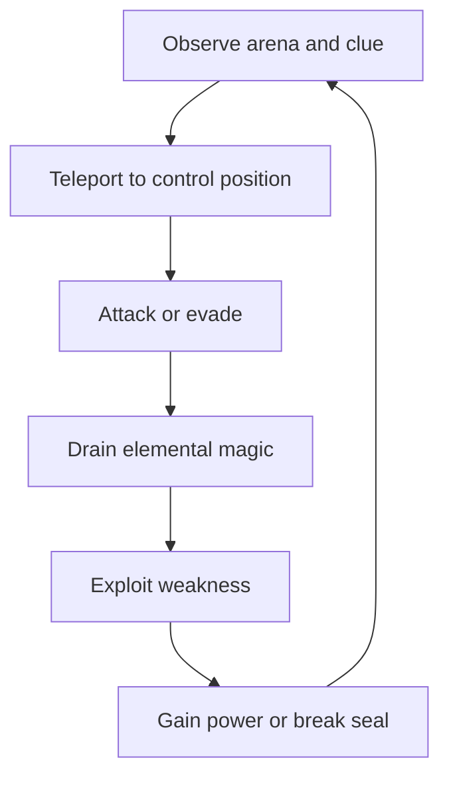

# Scene Proposal — The King’s Chamber

## Overview

The proposed scene is the climax of a fast 2.5D action roguelite. The player has deliberately surrendered their humanity to enter the Shadow World, where the faceless Shadow King is preparing to open a permanent portal and invade the human realm. Movement and combat remain on a readable side-view plane, while the characters, rooms, lighting, and effects use 3D assets. The scene contains three consecutive guardian rooms followed by the throne room. Each guardian teaches or tests one elemental interaction, and defeating it grants a power required in the finale.

The Shadow King cannot be killed by ordinary attacks. His immortality is sustained by the evil sorcerer who originally taught him to consume souls. The King has imprisoned that sorcerer in a cage inside the throne room to preserve the spell. While the King fires magical shots across the arena, the player must use teleportation and the three collected powers to break the cage seals, reach the prisoner, and kill him. The act reverses the ritual and destroys the King's immortality, but it also erases the shadow protagonist.

The scene is designed as a 15–20 minute vertical slice. It demonstrates the game's central promise: rapid sword combat and teleportation, knowledge-based boss encounters, elemental magic gained by draining defeated creatures, and a narrative in which gaining power costs the hero their identity.

The camera follows a fixed authored path with limited depth and rotation. Background architecture may extend into depth for scale, but the player and combatants stay on a single gameplay plane. The same modular walls, pillars, platforms, and cage components are relit and rearranged across all four rooms, reducing unique environment artwork while preserving visual variety.

## Scene goal

The player's explicit goal is to stop the Shadow King from completing the permanent portal. The mechanical goal is to defeat three guardians, absorb their powers, survive the King's projectile patterns, open the sorcerer's cage, and deliver the final strike.

The scene also has four design goals:

1. Make teleportation the player's primary verb in movement, defence, and attack.
2. Teach players to observe environmental clues before committing to a boss strategy.
3. Make collected powers function as keys and combat tools, not simple damage bonuses.
4. reveal that the apparent final boss is an obstacle while the caged sorcerer is the true objective.

## Scene flow

### Entrance corridor

The player enters the palace with a normal sword and short-range teleportation. A mural shows three guardians offering fire, water, and sight to the Shadow King. Beyond them, a fourth panel depicts a prisoner connected to the King's chest by magical threads. This foreshadows the solution without explaining it directly.

A checkpoint at the corridor entrance records the start of the boss rush. On standard difficulty, later checkpoints unlock after each guardian. A challenge mode can require completing the entire sequence in one life.

### Room one: The Ash Knight

The Ash Knight wears burning armour that repels normal sword attacks. Water-bearing lesser shadows enter through side doors. The player must kill one, drain its magic, and extinguish the Knight's armour. The exposed Knight can then be damaged by teleporting behind it and striking its core.

A stained-glass window shows the Knight kneeling beneath rain. This establishes the visual language used for all weakness clues. Defeating the boss grants **Fire Dash**, which turns a teleport through an enemy or fragile object into an attack.

### Room two: The Drowned Warden

The Warden floods the room and creates false bodies from the water. A damaged field journal near the entrance describes a jewel that once contained the creature with lightning. Lightning-bearing enemies spawn during the encounter. Draining them charges the flooded floor, stunning the Warden and revealing its real body.

The player must teleport between dry platforms before releasing the charge. Defeating the Warden grants **Tidal Guard**, a shield that absorbs one projectile and stores part of its energy.

### Room three: The Hollow Oracle

The Oracle fills the room with copies and hides its real form. A wall mosaic shows flame creating light and water creating reflection. The player uses Fire Dash to illuminate braziers and Tidal Guard's stored energy to activate reflective pools. Only the real Oracle produces a reflection. The player must identify it, teleport through the copies, and strike before the room becomes dark again.

Defeating the Oracle grants **Shadow Sight**, which exposes hidden objects and magical connections. This final reward reveals the true structure of the throne-room encounter.

### Final room: The King’s Chamber

The Shadow King stands between the player and a suspended cage. Initial sword attacks damage him, but his body reconstructs immediately. Activating Shadow Sight exposes three magical threads running from the cage seals to the King. The objective changes from **Defeat the Shadow King** to **Reverse the ritual**.

The King remains invulnerable and attacks throughout the remainder of the scene. His projectile set includes:

- **Tracking orbs:** slow shots that follow the player and reward late teleports.
- **Shadow beam:** a telegraphed line attack spanning the room.
- **Portal barrage:** shots fired in a readable sequence from portals around the arena.
- **Soul wave:** a circular blast released whenever a seal is destroyed.
- **Memory shot:** a rare projectile that temporarily removes interface information or distorts the player's silhouette.

The three cage seals require the powers earned from the guardians. Water energy removes the burning seal, Fire Dash breaks the flooded seal, and Shadow Sight reveals the hidden seal. When all three are destroyed, the cage falls to the floor.

The final sequence is a short test of execution. The player teleports through the King's barrage, uses Fire Dash to enter the cage, absorbs one unavoidable-looking shot with Tidal Guard, and reaches the sorcerer. The sorcerer warns that reversing the ritual will destroy every being sustained by shadow magic, including the protagonist. The player delivers the final sword strike.

The spell reverses. Stolen souls tear themselves out of the Shadow King, the permanent portal collapses, and the King briefly returns to his mortal form before dying. The protagonist disappears as the human world is saved by someone it can no longer remember.

## Core loop

At the moment-to-moment level, the player reads an attack, teleports to safety or advantage, lands a sword strike, and drains magic from a defeated enemy. At the encounter level, the player studies a clue, identifies the relevant element, creates an opportunity to use it, and attacks the newly exposed weakness. At the scene level, each victory adds a power that is required to solve the final room.

Teleportation uses three charges. A successful sword hit restores part of a charge, while defeating an enemy restores one full charge. This makes aggressive play sustainable without allowing unlimited defensive teleportation. A valid destination indicator communicates range and collision. The player receives a brief invulnerability window during transit but remains vulnerable on arrival.

## Success conditions

The scene is completed when the player:

1. Defeats the Ash Knight with water magic.
2. Defeats the Drowned Warden with lightning and the flooded environment.
3. Identifies and defeats the real Hollow Oracle.
4. Recognizes that the Shadow King regenerates and cannot be killed directly.
5. Survives the King's magical projectile patterns.
6. Breaks all three cage seals with the acquired abilities.
7. Reaches and kills the imprisoned sorcerer.

The success state triggers the ritual-reversal cinematic and closes the portal. Completion time, damage taken, uninterrupted teleport chains, and discovered clues can contribute to an optional rank, but ranking is outside the critical path.

## Failure conditions

The primary failure condition is health reaching zero. Falling into a lethal hazard also ends the current attempt. Each boss has a pressure mechanic—the Ash Knight fills the safe floor with fire, the Warden raises the water level, and the Oracle darkens the arena—but each is recoverable until the player's health is lost.

The finale must never become unwinnable because a player spent an elemental resource earlier. Guardian powers become permanent scene abilities after acquisition, with cooldowns rather than consumable charges. If the player dies in the throne room on standard difficulty, they restart at its entrance with all three abilities. If they die in a guardian room, they restart at that room's entrance.

The King may complete the portal after a generous encounter timer, creating an additional failure state only after playtesting confirms that it increases urgency without encouraging reckless play.

## Intended player experience

The opening rooms should create escalating mastery. The first guardian confirms that observation matters; the second combines magic with movement; the third asks the player to combine earlier knowledge. Each victory makes the player feel more capable and prepares them to confront the King.

The throne room then changes the nature of the challenge. The player first feels frustration and surprise when the King regenerates, followed by discovery when Shadow Sight reveals the spell connections. The encounter becomes a high-speed survival puzzle: the player is not attacking the source of the projectiles but moving through them toward the real objective.

The desired emotional sequence is **mastery, intimidation, discovery, pressure, sacrifice, and release**. Controls must remain immediate and readable even when the screen is busy. Projectile patterns should appear dangerous but form deliberate paths that a skilled player can cross through precise teleports.

The final action should feel morally uncomfortable. The sorcerer is imprisoned and apparently defenceless, yet killing him is the only way to reverse the spell. His warning reframes victory as a conscious sacrifice. The closing image—a faceless hero disappearing after saving people who cannot remember them—connects the mechanic of soul loss to the game's central theme.
