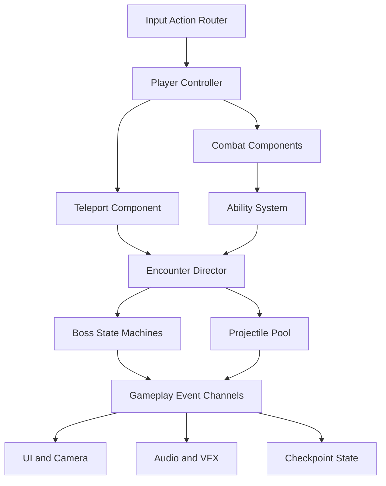

# Technical Plan

## Assumptions

- Target: PC vertical slice
- Format: single-player 2.5D side-view action roguelite
- Engine: Unity 6 LTS with Universal Render Pipeline (URP)
- Target length: 15–20 minutes
- Performance target: stable 60 FPS at 1920×1080
- Input: keyboard/mouse and gamepad
- Art strategy: reusable modular 3D assets, constrained camera, shared rigs and materials
- Team model: small multidisciplinary student team; role ownership can collapse to one developer

## Why 2.5D reduces the art workload

Gameplay takes place on a two-dimensional movement plane, but the world is rendered with 3D models. This avoids large frame-by-frame sprite sets and allows a small library of meshes, rigs, materials, lights, and effects to be reused from multiple angles. The team can rearrange and relight one palace kit across the guardian rooms rather than create four unique painted environments.

This saving depends on strict constraints. The camera will follow authored rails, combat depth will remain locked, and there will be no free camera, exploration behind scenery, or fully navigable 3D arenas. Bosses share a humanoid base rig where their silhouettes permit it. Each guardian receives a small number of distinctive attachments, materials, and signature animations instead of a completely unique production pipeline.

## Toolchain choices

| Area | Choice | Reason |
|---|---|---|
| Engine | Unity 6 LTS | Stable long-term baseline, mature 3D pipeline, strong profiling and platform support |
| Rendering | URP | Efficient stylized lighting, Shader Graph support, suitable for PC and lower-end targets |
| Language | C# | Native Unity workflow and clear component architecture |
| Input | Unity Input System | Keyboard/mouse and gamepad action maps with rebinding support |
| Camera | Unity Cinemachine | Authored side-view camera rails, framing, shake, and transitions |
| Level blockout | ProBuilder | Rapid modular 3D greyboxing inside Unity |
| Data | ScriptableObjects | Designer-editable attacks, abilities, bosses, and encounter settings |
| Animation | Animator, Animation Rigging | Shared rigs, state machines, constraints, and reusable animation layers |
| VFX | Particle System and Shader Graph | Teleport, elements, ritual links, and readable telegraphs |
| Art | Blender; Krita or Photoshop | Low-poly modular assets, rigging, textures, UI, and concept paintovers |
| Audio | Unity Audio Mixer; Reaper or Audacity | Adequate adaptive layers and cue processing without middleware overhead |
| Testing | Unity Test Framework plus test scenes | Edit Mode tests for logic and focused Play Mode checks |
| Source control | Git + Git LFS | Pull-request review; LFS for binary models, textures, and audio |

FMOD, Addressables, DOTS, and third-party combat frameworks are outside the slice unless profiling or course requirements establish a need.

## Systems architecture



### Player controller and movement plane

The player uses a CharacterController or kinematic Rigidbody constrained to the gameplay X/Y plane. World depth remains fixed except for authored transitions. The controller owns locomotion, jump state, facing, animation parameters, damage reception, and action locks. It delegates teleportation and attacks to dedicated components so they can be tested independently.

### Teleport component

The component calculates aim direction and maximum distance, projects the destination onto the gameplay plane, performs collision-safe capsule checks, exposes valid/invalid indicators, spends and restores charges, and raises departure/arrival events. Valid surfaces use layers rather than scene names. The system supports brief transit invulnerability and optional aim slowdown.

### Combat and health

Animation events activate reusable hitbox components. A `DamageData` payload contains amount, element, knockback, source, and gameplay tags. Health components own damage, invulnerability, death, and reset events. Sword attacks restore teleport charge only after a confirmed hit.

### Ability system

Each guardian power is a ScriptableObject containing cooldown, element, animation reference, effects, and tags. Fire Dash modifies teleport collision, Tidal Guard intercepts one eligible projectile, and Shadow Sight reveals objects implementing a revealable interface. Acquired abilities persist across throne-room retries.

### Enemy and boss logic

Each boss uses a hierarchical C# state machine with common states: intro, idle, select attack, anticipation, execution, recovery, stagger, phase transition, and death. Attack definitions are ScriptableObjects. Boss-specific components implement weakness exposure and arena interaction. The three guardians share base health, targeting, animation-event, and hit-reaction components.

### Encounter director

Controls room entry, gates, spawn points, boss phase progression, checkpoints, and success/failure transitions. In the final room it tracks three seal states and changes the objective after Shadow Sight exposes the ritual links.

### Projectile pool

Uses `UnityEngine.Pool.ObjectPool<T>` or an equivalent small pool to reuse projectiles. Trajectory behaviours include straight, tracking, radial, and portal-sequenced. Projectile ScriptableObjects define speed, damage, telegraph duration, collision layer, lifetime, VFX, and audio cue.

### Clue and interaction system

Books, stained glass, and mosaics implement a shared `IInteractable` contract. Clues can be inspected but do not gate boss damage directly. A discovered-clue flag may add a short UI reminder without solving the encounter for the player.

### Checkpoints and scene state

A lightweight persistent service stores defeated guardians, unlocked abilities, current checkpoint, accessibility options, and completion metrics. Data is serialized only at room transitions. Runtime combat state resets on death.

### Feedback layer

ScriptableObject event channels or C# events decouple gameplay from Cinemachine impulse, hit stop, particles, audio, interface updates, and controller vibration. Gameplay code raises semantic events such as `TeleportArrived`, `WeaknessExposed`, and `SealBroken`.

## Proposed Unity project structure

```text
Assets/
  Art/
    Materials/
    Models/
    Textures/
    VFX/
  Audio/
  Data/
    Abilities/
    Attacks/
    Encounters/
  Prefabs/
    Bosses/
    Environment/
    Player/
    Projectiles/
    UI/
  Scenes/
    Bootstrap.unity
    BossRush.unity
    Test/
  Scripts/
    Abilities/
    Combat/
    Core/
    Enemies/
    Encounters/
    Player/
    UI/
  Settings/
  Tests/
Packages/
ProjectSettings/
```

## 2.5D content budget

| Content | Maximum for slice | Reuse rule |
|---|---:|---|
| Modular environment meshes | 15 | Rearrange across all four rooms |
| Hero model and rig | 1 | All player animations use one rig |
| Guardian base rigs | 2 | Share humanoid rig where possible |
| Unique boss attachments | 3 sets | One small silhouette kit per guardian |
| Boss attacks | 3–4 each | Reuse shared telegraph and hit components |
| Materials | 8 master instances | Colour/parameter variants instead of new shaders |
| Major VFX graphs | 6 | Recolour and parameterize by element |
| Cinematic sequences | 1 short ending | In-engine camera and animation only |

## Risk list

| Risk | Probability | Impact | Mitigation / exit criterion |
|---|---:|---:|---|
| Teleport aiming feels imprecise | High | High | Prototype in greybox; validate both input types before M2 |
| Player appears to teleport into background depth | Medium | High | Project aim and destination indicator onto one gameplay plane |
| 3D colliders allow clipping or arena escape | High | High | Capsule checks, authored bounds, layer matrix, automated destination tests |
| Camera perspective reduces distance readability | Medium | High | Narrow FOV, fixed angle, shadow/contact cues, usability test |
| Projectile VFX become unreadable | Medium | High | Fixed hostile palette, density budget, rim light, target-resolution review |
| 3D art expands instead of reducing work | High | High | Enforce modular kit and asset budget; no unique room kits or free camera |
| Three bosses exceed schedule | High | High | Share rigs/components; cap each boss at four attacks and one phase change |
| Weakness clues are too vague | Medium | Medium | Five-player test; 4/5 should infer each weakness within two attempts |
| Finale becomes unwinnable | Medium | High | Cooldown abilities rather than consumables; checkpoint before throne room |
| Effects cause frame drops | Medium | Medium | Pool projectiles, cap lights and particles, profile every milestone |
| Scope expands into a full roguelite | High | High | No procedural generation, randomized loot, meta-progression, or extra biome |
| Unity scene/prefab merge conflicts | Medium | Medium | Small prefabs, scene ownership, visible meta files, Force Text serialization |

## Scope boundaries

### In scope

- One entrance corridor and four authored 2.5D combat rooms
- Fixed side-view gameplay plane with Cinemachine-authored camera transitions
- One player model, rig, sword moveset, and material set
- Run, jump, sword combo, teleport, and three guardian powers
- Three bosses with one weakness and up to four attacks each
- Shadow King projectile controller without a conventional damage phase
- Modular palace environment kit reused across every room
- Three cage seals, caged sorcerer, and ritual-reversal ending
- Checkpoints at guardian rooms and the throne room
- Keyboard/mouse and standard gamepad support
- Essential UI, audio, VFX, pause, settings, and accessibility toggles
- One Windows development build

### Out of scope

- Free 3D camera or unrestricted movement in depth
- Unique environment kit for every room
- Procedural level generation
- Full roguelite meta-progression or randomized loot
- Additional weapons or playable characters
- Open-world or branching levels
- Multiplayer or online services
- Voice acting and localization
- Multiple endings or a playable human-world chapter
- Full Shadow King damage phase
- Console/mobile certification
- Steam integration, achievements, or analytics

## Technical acceptance criteria

- Teleport never places the player inside collision or outside the gameplay plane in 100 scripted attempts.
- Camera framing keeps the player, threat, and destination visible during every required action.
- The player can distinguish every hostile telegraph at 1080p.
- Final barrage maintains 60 FPS on the agreed test machine.
- All critical actions work on keyboard/mouse and gamepad.
- Room reset completes in under eight seconds.
- A clean checkout opens and builds using the recorded Unity editor version.
